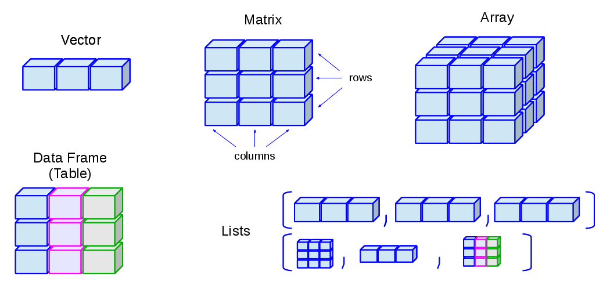
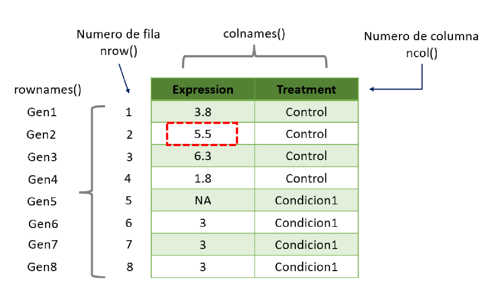

```{css, echo=FALSE}
/* colors */
/* timing */
/* sizes */

@import url('https://fonts.googleapis.com/css2?family=Rubik:ital,wght@0,459;1,459&display=swap');

@import url('https://fonts.googleapis.com/css2?family=Inter:ital,opsz,wght@0,14..32,100..900;1,14..32,100..900&display=swap');


body, button, input, textarea {
  font-family: 'Inter', serif;
  font-weight: 309;
  color: #899ce7;
  background: #101c4dff;
}

strong{
  color: white;
  font-family: 'Inter', serif;
  font-weight: 700;
}

img{
 border-radius: 10px;
}

a {
text-decoration: none;
color: white;
transition: .3s;
}
a:hover{
color: #bc3b7d;
text-decoration: none
}

.modal-dialog{
  border: 2px #4a67d9ff solid;
  border-radius: 10px;
  backdrop-filter: blur(5px);
  background-color: unset;
}

.modal-content{
  backdrop-filter: blur(5px);
  background-color: unset;
}

.hljs-number{
 color: #e785adff;
}

.hljs-comment{
 color: #9d4edd;
}

.hljs-string{
 color: #ec4583ff;
}


/* content */
h1, h2, h3, h4, h5, h6 {
  font-family: 'Rubik', serif;
  color: #fffff0;
  font-weight: 300; }

h1 {
  font-size: 2.4em;
  margin: .75em 0 .5em 0; }

.tutorialTitle {
  font-size: 1.75em;
}

.alert a{
  color: #bc3b77;
  transition: 0.5s;
}

.alert a:hover{
  color: #bc3b70ba;
  text-decoration:
}

h2 {
  font-size: 2.0em;
  margin: .75em 0 .5em 0; }

h3 {
  font-size: 1.6em;
  margin: .75em 0 .5em 0; }

h4 {
  font-size: 1.2em;
  margin: .75em 0 .5em 0; }

p {
  line-height: 1.6em;
  margin-bottom: 1em; }

ul {
  line-height: 2em;
  list-style: disc outside none; }
.btn, .modal-content .btn+.btn {
  padding: 10px 20px;
  border-radius: 3px;
  margin-bottom: 0px; }

.btn-xs, .btn-group-xs > .btn {
  padding: 1px 5px;
  font-size: 0.9em;
  line-height: 1.6em; }

.btn-default {
  background-color: #bc3b77ff;
  background-image: none;
  color: white;
  border: none; }
  .btn-default:hover {
    background-color: #bc3b77d8; 
    color: white}
  .btn-default:focus {
    background-color: #bc3b77ff; }

/* TODO-barret add css for btn-warning */

.btn-primary, .btn-success, .btn-info {
  background-color: #bc3b77ff;
  background-image: none;
  color: white;
  border: none; }
  .btn-primary:hover, .btn-primary:focus, .btn-primary:active, .btn-primary:focus:active, .btn-success:hover, .btn-success:focus, .btn-success:active, .btn-success:focus:active, .btn-info:hover, .btn-info:focus, .btn-info:active, .btn-info:focus:active {
    background-color: #bc3b77db; }
  .btn-primary:focus:hover, .btn-primary:active:hover, .btn-primary:focus:active:hover, .btn-success:focus:hover, .btn-success:active:hover, .btn-success:focus:active:hover, .btn-info:focus:hover, .btn-info:active:hover, .btn-info:focus:active:hover {
    background-color: #bc3b77d0; }
  .btn-primary.disabled, .btn-primary:disabled, .btn-primary.disabled:hover, .btn-primary:disabled:hover, .btn-success.disabled, .btn-success:disabled, .btn-success.disabled:hover, .btn-success:disabled:hover, .btn-info.disabled, .btn-info:disabled, .btn-info.disabled:hover, .btn-info:disabled:hover {
    background-color: #bc3b77db; }

.panel, pre {
  border-radius: 0;
  border: 2px solid;
  border-color: #4a67d9ff; 
  background-color: #17286eff;
  }
pre {
  border-color: #4a67d9ff; 
  background-color: #17286eff;
}

code {
  color: #ffd78fff;
  background-color: #17286eff
}

/* sidebar */
.topicsList .topic {
  line-height: 20px;
  font-size: 15px;
  padding-left: 10px;
  cursor: pointer;
  color: white;

  background-color: unset;
  background-repeat: no-repeat;
  background-size: 2px 80px;
  background-position: left 100%;
  border-bottom: 1px solid #bc3b77db;
}

.topicsList .topic .nav-link {
  color: white;
}
.topicsList .topic .nav-link:hover {
  background-color: #bc3b77ee;
  color: #fffff0; /* Un gris claro */
  /* O podrías usar otros efectos como: */
  text-decoration: underline;
  text-decoration-color: #4a67d9ff
  /* O cambiar la opacidad: */
  opacity: 1;
  /* O añadir una transición suave: */
  transition: all 0.3s ease;
}
.section pre{
  border-color: #4a67d9ff; 
  background-color: #17286eff;
}

.section code{
  color: #ffd78fff ;
}


td{
color: #899ce7ff;
border-bottom: 1px #2541b1ff solid;
}

thead {
  border-bottom: 1px white;
  font-family: 'Rubik', serif;
  font-weight: 450;
}

.topicsList .topic.current {
  background-color: #4a67d9;
  font-weight: normal;
}

#tutorial-topic{
background-color: unset;
backdrop-filter: blur(5px);
}

/* quiz css */

.questions {
  padding: 8px;
  margin-bottom: 0;
}

.questions h3 {
  font-weight: 500;
  margin-bottom: 15px;
  margin-top: 0;
  font-size: 1.1em;
}

.alert {
  width: fit-content;
}

/* .answers {
  padding-left: 25px;
  margin-bottom: 15px;
} */

/* .answers label {
  font-weight: 400;
  margin-left: 4px;
} */

/* .responses {
  padding-left: 0;
} */

/* .answers .checked::after {
  content: " \2713 ";
} */
/* .answers .invalid::after {
  content: " \1F5F4 ";
} */

/* .responses .alert {
  padding: 6px 12px;
  margin-bottom: 0;
} */

 .quiz-table .panel {
  border: none;
  box-shadow: none;
  margin-bottom: 0;
}

/* .quiz-table > tbody > tr > td {
  padding: 0;
} */

 .quiz .panel-body {
  padding: 10px;
} 

/* .checkAnswer i {
  margin-right: 8px;
} */

/* .tryAgainButton {
  margin-top: 10px;
} */


.pageContent {
}

.band {
  padding-left: 5%;
  padding-right: 5%;
  position: relative;
}

.bandContent {
  margin: 0 auto;
  max-width: 1200px;
}

.bandContent.page {
  display: flex;
  display: -ms-flexbox;
  display: -webkit-box;
  display: -webkit-flex;

  justify-content: space-between;
  -webkit-justify-content: space-between;
  -ms-flex-pack: justify;

  flex-direction: row-reverse;
  -webkit-flex-direction: row-reverse;
}

.topics {
  width: 75%;
  overflow-x: auto;
  padding: 0 0.5em 600px;
}

.topics .tutorialTitle {
  display: none;
  border-bottom: 3px dotted red;
}

.topics .section.level2 {
  display: none;
  margin-bottom: 40px;
}

.topics .section.level2.current {
  display: block;
}

.topicsContainer {
  width: 23%;
  min-width: 270px;
  margin-right: 2%;
  z-index: 100;
}

.topicsPositioner {
  position: fixed;
  left: 0px;
  width: 100%;
  height: 0px;
  background-color: pink;
}

.topicsList {
  float: left;
  position: relative;
  width: 23%;
  min-width: 270px;
  overflow: auto;
  height: auto;
  scroll-behavior: smooth;
  transform: translateZ(0); /* force repaint to work on older browser used in the IDE */
}

.topicsHeader {
  display: flex;
  display: -ms-flexbox;
  display: -webkit-box;
  display: -webkit-flex;

  justify-content: space-between;
  -webkit-justify-content: space-between;
  -ms-flex-pack: justify;
}

.topicsFooter {
  margin-top: 10px;
  padding-bottom: 20px;
}

.topicsFooter .resetButton {
  font-size: .66em;
  cursor: pointer;
  opacity: .7;
}

.topicsFooter .resetButton:hover {
  opacity: 1;
}

.topicsList .topic.current {
  font-weight: bold;
}

.topicsList .nav-link {
  padding-left: 0;
}

.tutorial-is-bs3 .topicsList .topic,
.tutorial-is-bs3 .topicsList .nav-link,
.tutorial-is-bs3 .topicsList .resetButton {
  padding-left: 1em;
  margin-left: -1em;
}

.tutorial-is-bs3 .topicsList {
  padding-left: 1em;
}

.section.level3 {
  margin-bottom: 40px;
}

.paneCloser {
  display: none;
  height: 30px;
  width: 30px;
  background: url(images/close.svg) no-repeat center center;
  background-size: 30px 30px;
  border-radius: 15px;
  position: relative;
  top: 8px;
}

.paneCloser:hover {
  background-color: rgba( 0, 0, 0, .05);
}

.section.level3.hide {
  display: none;
}

.section.level3.done h3 {
  padding-left: 25px;
  background-image: url(images/exerciseDone.svg);
  background-size: 20px 20px;
  background-position: left center;
  background-repeat: no-repeat;
}

.exerciseActions {
  margin: 20px 0;
}

.skip {
  display: none;
}

.r code{
 color: white;
}

.showSkip .skip {
  display: inline-block;
}

.topicActions {
  margin-top: 20px;
}

.topicActions button {
  margin-right: 10px;
}

.section.level2.hideActions .topicActions {
  display: none;
}

#doc-metadata {
  margin-bottom: 10px;
  line-height: 1.6em;
}

#doc-metadata h3 {
  margin: 0;
  font-size: 1.2em;
  line-height: 2em;
}

#doc-metadata h4 {
  margin: 0;
  font-size: 1em;
  line-height: 1.6em;
}

#doc-metadata em {
  font-style: normal;
}

@media screen and (max-width: 767px) {
  .topics {
    width: 99%;
  }

  .topics .tutorialTitle {
    display: block;
    cursor: pointer;
  }

  .topicsContainer {
    width: 1%;
    min-width: 1px;
    margin-right: 0;
  }

  .topicsList.hideFloating {
    display: none;
  }

  .paneCloser {
    display: inline-block;
  }
}

/* override the width to be 100%, not 300px wide */
.shiny-input-container:not(.shiny-input-container-inline) {
  width: 100%;
}
```

## Introduccion

[--\> Regresar a la pagina principal](https://viernesbioinformatica.github.io/)

En este tutorial aprenderas a manipular datos con R base.

```{r setup, include=FALSE}
library(learnr)
library(gradethis)
gradethis::gradethis_setup()
library(datasets)
Flores <- iris


ClaseBioinfo <- c("Jose Luis", "Diego", "Rosita", "Yuri", "Ulises", "Tere", "Luz", "Chucho")

df <- data.frame(genes = paste0("Gen", seq_len(8)),
                 expression = c(3.8, 5.5, 6.3, 1.8, 9, rep(3,3)),
                 treatment = c(rep("Control", 4), rep("Condicion1",4)))

```

### ¿Tienes instalado R?

```{r quiz1, echo=FALSE}
question("¿Tienes instalado R/Rstudio?", 
         answer("Si",correct = T,),
         correct = "¡Bien! Continuemos con el tutorial.",
         answer("No"),
         incorrect = "Por favor instala R y Rstudio para continuar con el tutorial. https://posit.co/download/rstudio-desktop/"
         )
```

### Paquetes necesarios!

```         
install.packages("rmarkdown")
install.packages("dplyr")
install.packages("reshape2")
install.packages("remotes")
```

## Estructura de datos

### Existen diferentes tipos de estructuras de datos en R, las mas comunes son:

Las estructuras de datos son objetos dentro de R que permiten almacenar información de diferentes tipos. Las estructuras de datos más comunes en R son:

| Tipo de estructura | Declaracion de la variable | Conversión | Dimensiones | Contenido |
|---------------|---------------|---------------|---------------|---------------|
| Vector | `c()`,`rep()`,`valorI:valorN`;`seq_len()` | `as.vector()` | 1 | homogenea |
| Matriz | `matrix(valores, nrow=x, ncol=y)` | `as.matrix()` | 2 | heterogenea |
| Data frame | `data.frame(x=1:3, y=4:6)` | `as.data.frame()` | 2 | heterogenea |
| List | \``list(1:3, 4:6)` | `as.list()` | 1 | homogenea |

Tambien estan los `array` pero no los veremos en este tutorial. Para conocer la estructura del objeto debes usar `str()`.

Una lista puede contener matrices en su interior, vectores, funciones, etc.

{width="500"}

### Clases de variables

Las variables en R pueden ser de diferentes clases, las más comunes son:

| Clase de variable | Declaracion | Conversion de formato | Reglas |
|------------------|------------------|------------------|------------------|
| numeric | `numeric()` | `as.numeric()` | FALSE -\> 0, TRUE -\> 1; "1","2" -\> 1,2 "A" -\> NA |
| integer | `integer()` | `as.integer()` | FALSE -\> 0, TRUE -\> 1; "1","2" -\> 1,2 "A" -\> NA |
| character | `character()` | `as.character()` | FALSE -\> "FALSE", TRUE -\> "TRUE"; 1,2 -\> "1","2" "A" -\> "A" |
| logical | `logical()` | `as.logical()` | 0 -\> FALSE, [!0] -\> TRUE; "FALSE","TRUE" -\> FALSE, TRUE "A" -\> NA |
| double | `double()` | `as.double()` |  |
| factor | `factor()` | `as.factor()` |  |

Para saber la clase de variable se usa `class()`.

> `as.integer()` convierte a entero, redondeando hacia abajo.

### Operadores

| Aritmeticos           | Comparacion           | Logicos                     |
|----------------------|----------------------|----------------------------|
| \+ Suma               | \< Menor que          | !x NOT x (logical NOT)      |
| \- Resta              | \> Mayor que          | x & y x AND y (logical AND) |
| \* Multiplicacion     | \<= Menor o igual que | x `|` y x OR y (logical OR) |
| / Division            | \>= Mayor o igual que | x && y identico             |
| %/% Division Integral | != Diferente de       | x %in% y x en y             |
| \^ Potencia           | == Igual que          |                             |

## Vectores

### Ejercicio 1

```{r ejercicio1, exercise=TRUE, exercise.blanks = "___+"}
# Haz un vector con los numeros del 1 al 10 usando :
___:___
# Haz un vector con los numeros del 1 al 10 usando c()
c(___)
# Haz un vector con los numeros del 1 al 10 usando seq_len()
seq_len(___)
```

```{r ejercicio1-solution}
# Haz un vector con los numeros del 1 al 10 usando :
1:10
# Haz un vector con los numeros del 1 al 10 usando c()
c(1,2,3,4,5,6,7,8,9,10)
# Haz un vector con los numeros del 1 al 10 usando seq_len()
seq_len(10)
```

```{r ejercicio1-code-check}
grade_code()
```

### Ejercicio 2

```{r ejercicio2, exercise=TRUE, exercise.blanks = "___+"}
# Muestra la estructura del dataset "Flores"
___(Flores)
```

```{r ejercicio2-solution}
str(Flores)
```

```{r ejercicio2-code-check}
grade_code()
```

### Ejercicio 3

```{r ejercicio3, exercise=TRUE, exercise.blanks = "___+"}
# Muestra la clase de la variable "Species" del dataset "Flores"
___(Flores$Species)

# Convierte la variable "Species" a caracter
Flores$Species <- ___(Flores$Species)

# Revisa la clase de la variable "Species"
___(Flores$Species)
```

```{r ejercicio3-solution}
# Muestra la clase de la variable "Species" del dataset "Flores"
class(Flores$Species)

# Convierte la variable "Species" a caracter
Flores$Species <- as.character(Flores$Species)

# Revisa la clase de la variable "Species"
class(Flores$Species)
```

```{r ejercicio3-code-check}
grade_code()
```

### Ejercicio 4

```{r ejercicio4, exercise=TRUE}
ClaseBioinfo <- c("Jose Luis", "Diego", "Rosita", "Yuri", "Ulises", "Tere", "Luz", "Chucho")

# Verifica su estructura

# Verifca donde esta " Luz"

# Verifica si "Jose Luis" y "Diego"  esta en la lista

# Revisa quien esta en la posicion 3

```

```{r ejercicio4-solution}
ClaseBioinfo <- c("Jose Luis", "Diego", "Rosita", "Yuri", "Ulises", "Tere", "Luz", "Chucho")

# Verifica su estructura
str(ClaseBioinfo)
# Verifca donde esta " Luz"
ClaseBioinfo == "Luz"
# Verifica si "Jose Luis" y "Diego"  esta en la lista
ClaseBioinfo %in% c("Jose Luis", "Diego")
# Revisa quien esta en la posicion 3
ClaseBioinfo[3]
```

### Ejercicio 5

```{r ejercicio5, exercise=TRUE, exercise.blanks = "___+"}
# Haz que Control se repita 5 veces
Control <- rep("Control", ___)
Control # Output
# Haz que Condicion se reptia 2 veces
Condicion <- rep(___, 2)
Condicion
# Ahora haz que Control y Condicion se repitan 3 veces
ControlCondicion <- rep(c(___, ___), ___)
ControlCondicion
```

```{r ejercicio5-solution}
# Haz que Control se repita 5 veces
Control <- rep("Control", 5)
Control # Output
# Haz que Condicion se reptia 2 veces
Condicion <- rep("Condicion", 2)
Condicion
# Ahora haz que Control y Condicion se repitan 3 veces
ControlCondicion <- rep(c("Control", "Condicion"), 3)
ControlCondicion
```

```{r ejercicio5-code-check}
grade_code()
```

### Ejercicio 6

```{r ejercicio6, exercise=TRUE, exercise.blanks = "___+"}
Control <- rep("Control", 3)
Condicion <- rep("Condicion", 3)
# Ya que el anterior ejercicio los dio intercalados, ahora intentalo hacerlo de manera secuencial
Vector <- c(___, ___)
Vector # Output
```

```{r ejercicio6-solution}
Control <- rep("Control", 3)
Condicion <- rep("Condicion", 3)
# Ya que el anterior ejercicio los dio intercalados, ahora intentalo hacerlo de manera secuencial
Vector <- c(Control, Condicion)
Vector # Output
```

```{r ejercicio6-code-check}
grade_code()
```

### ¿Como vamos?

{width="500"}

### Ejercicio 7

```{r ejercicio7, exercise=TRUE}
# Crea un vector con el nombre "Colores" que contenga 2 veces la palabra "Rojo", 3 veces la palabra "Azul" y 4 veces la palabra "Verde" USA rep() (No supe como ajustar esto para que tuviera diferentes respuestas D:)

# Señala como TRUE donde la palabra sea Azul

# Revisa la clase del vector "Colores"

# Convierte el vector "Colores" a factor


```

```{r ejercicio7-solution}
# Crea un vector que contenga 2 veces la palabra "Rojo", 3 veces la palabra "Azul" y 4 veces la palabra "Verde" USA rep() (No supe como ajustar esto para que tuviera diferentes respuestas D:)
Colores = rep(c("Rojo", "Azul", "Verde"), c(2, 3, 4))

# Señala como TRUE donde la palabra sea Azul
Colores == "Azul"

# Revisa la clase del vector "Colores"
class(Colores)

# Convierte el vector "Colores" a factor
Colores <- as.factor(Colores)
```

```{r ejercicio7-code-check}
grade_code()
```

## Dataframe

### Hacer un dataframe a partir de un conjunto de vectores

Podemos declarar los componentes de un dataframe en variables separadas y luego juntarlo en una sola linea usando `data.frame()`.

```{r}
# Declaramos los componentes
a <- 1:5
b <- 2
c <- seq_len(2)
d <- c(4,2)

data.frame(a,b) # Juntamos los componentes con el comando `data.frame`
```

```{r}
data.frame(c,d)
```

### Dataframe en una sola linea

Tambien podemos hacer el dataframe con datos en una sola linea.

```{r}
data.frame(x = 1:4, n = 10)
```

### ¿Que pasa si hay diferente numero de filas?

#### ¡Intentalo!

```{r ejercicioa, exercise = TRUE}
data.frame()
```

### Dataframe: Estructura y clases de variables

Cada columna es una **variable** la cual puede ser de un tipo o clase

```{r}
df <- data.frame(genes = paste0("Gen", seq_len(8)),
                 expression = c(3.8, 5.5, 6.3, 1.8, 9, rep(3,3)),
                 treatment = c(rep("Control", 4), rep("Condicion1",4)))

head(df)
```

Es un dataframe con 3 variables(genes, expression y treatment) y cada uno tiene su propia clase.

> Recuerda que para ver la clase de cada objeto se usa `class()` y para ver la estructura completa se usa `str()`

```{r ejerciciob, exercise = TRUE}
# Revisa la estructura del dataframe creado anteriormente

```

```{r ejerciciob-solution}
# Revisa la estructura del dataframe creado anteriormente

str(df)
```

```{r ejerciciob-code-check}
grade_code()
```

### Dataframe con los datos de la clase

Vamos a juntar un vector nuevo con las edades, llamado, `edad`, posteriormente, vamos a combinarlo con el vector que creamos previamente `ClaseBioinfo`

```{r ejercicioc, exercise = TRUE, exercise.blanks = "___+"}
# Declarar un vector e incorporarlo en el data.frame()
edad <- c(18,19,20,22,19,21,23,24)

# Almacenar en el vector

ClaseBioinfo <- ___(___, ___)
ClaseBioinfo

```

```{r ejercicioc-solution}
# Declarar un vector e incorporarlo en el data.frame()
edad <- c(18,19,20,22,19,21,23,24)

# Almacenar en el vector

ClaseBioinfo <- data.frame(ClaseBioinfo, edad)
ClaseBioinfo

```

```{r ejercicioc-code-check}
grade_code()
```

### Podemos agregar columnas

Usando `$` despues del nombre del data frame

```{r, include=FALSE}

# Declarar un vector e incorporarlo en el data.frame()
edad <- c(18,19,20,22,19,21,23,24)

# Almacenar en el vector

ClaseBioinfo <- data.frame(ClaseBioinfo, edad)
```

```{r}
ClaseBioinfo$formacion <- c("Medicina", "Medicina", "Medicina", "Biologia", "Biologia", "Biologia", "Genomica", "Genomica")
ClaseBioinfo
```

### Dataframe: Espacio Faltante

Si queremos agregar algo y es multiplo de la longitud de la columna se rellena.

```{r}
ClaseBioinfo <- c("Jose Luis", "Diego", "Rosita", "Yuri", 
                  "Ulises", "Tere", "Chucho", "Evelia", "Fulanito", "Luz")
edad <-c(31,32, 30, 30, 28, 32, 29,29,30, 19)
ClaseBioinfo <- data.frame(ClaseBioinfo, edad) # crear dataframe
ClaseBioinfo$formacion <- c("medicina", "nutricion", "biologia","genomicas","programacion")
head(ClaseBioinfo, 5)

```

## Ejercicios:

A patir del siguiente dataset, completa los ejercicios:

```{r}
df <- data.frame(genes = paste0("Gen", seq_len(8)), 
                 expression = c(3.8, 5.5, 6.3, 1.8, 9, rep(3,3)), 
                 treatment =c(rep("Control", 4), rep("Condicion1",4)))

```

### 1.- Convierte la columna 3 perteneciente a tratamiento (treatment) a factor.

> NOTA: En este ejemplo, solo tenemos dos condiciones “Control” y “Condicion1”. Por lo que, solo deben hacer dos niveles (levels).

```{r df1, exercise=TRUE}


```

```{r df1-solution}
df$treatment <- as.factor(df$treatment)
```

```{r df1-code-check}
grade_code()
```

### 2.- Renombra las filas con los nombres de los genes.

> NOTA: Recuerda que para renombrar las filas es `rownames()` y las columnas se usa `colnames()`.

```{r df2, exercise=TRUE}

```

```{r df2-solution}
rownames(df) <- df$genes
df <- df[,-1]
```

```{r df2-code-check}
grade_code()
```

> NOTA: El signo de dinero `$` nos permite seleccionar una columna (variable) de un dataframe.

## Index

Por medio de un **Index** podemos:

```         
1) Obtener la informacion de un dato en especifico

2) Modificar un dato en especifico

3) Eliminar un dato en especifico
```

Podemos hacer la pregunta de dos maneras, 1) ¿Cuál es el nivel de expresión del Gen2? O 2) ¿Que gen contiene una expresión de 5.5?

{width="600"}

## Ejemplos de Uso de Index

### 1.- ¿Cuál es le nivel de expresion del Gen 2?


```{r ejemplo1, exercise = TRUE}

```

```{r ejemplo1-solution}
# Opcion A
df[2,1]
# [1] 5.5
# Opcion B
df$expression[2]
# [1] 5.5
# Opcion C
df["Gen2",]
#      expression treatment
# Gen2        5.5   Control
df["Gen2",1]
# [1] 5.5
# Opcion D
df["Gen2","expression"]
# [1] 5.5
```

### ¿Que gen contiene una expresion de 1.8?

```{r ejemplo2, exercise = TRUE}

```

```{r ejemplo2-solution}
# Opcion A
df[df[, "expression"] == 1.8,]
#      expression treatment
# Gen4        1.8   Control
df[df[, 1] == 1.8,]
#      expression treatment
# Gen4        1.8   Control
# Opcion B
df[df == 1.8,]
#      expression treatment
# Gen4        1.8   Control
# Opcion C
df[df$expression == 1.8,]
#      expression treatment
# Gen4        1.8   Control
# Opcion D
subset(df, expression == 1.8)
#      expression treatment
# Gen4        1.8   Control

```

## Index usando un vector

Podemos crear una variable `i` que será nuestro index para extraer valores

```{r i}
x <- 1:5
i <- c(1, 3) # el index es numero y nos permite extraer la posicion 1 y 3 del vector

x[i]
```
```{r}
x <- 1:5
i <- c(1, 3) # el index es numero y nos permite extraer la posicion 1 y 3 del vector

x[i]
```

### Ejercicio 

Usa `i` para obtener las filas del dataframe

```{r ejercicioz, exercise = TRUE, exercise.blanks = "___+", exercise.setup = "i"}

df[___,]

```

```{r ejercicioz-solution}

df[i,]

```

```{r ejercicioz-code-check}
grade_code()
```

## Más ejercicios

### Vector

```{r exercise1, exercise = TRUE}

# Declarar el vector con 5 posiciones (del 1 al 5)

# Observar el componente / posicion 3

# Observar multiles posiciones

# Sustituir el valor de la posicion 3

# Eliminar la posicion 1

```

```{r exercise1-solution}

# Declarar el vector con 5 posiciones (del 1 al 5)
x <- 1:5
x
# Observar el componente / posicion 3
x[3]
# Observar multiles posiciones
x[c(1,3)]
x[c(1:3,5)] # OR x[-4]
# Sustituir el valor de la posicion 3
x[3] <- 20
x
# Eliminar la posicion 1
x[-1]
```

```{r exercise1-code-check}
grade_code()
```

### Matriz

```{r exercise2, exercise = TRUE}

# Genera una matriz de tamano 2 x 3 (filas, columnas) (rows, columns) 

# # Sustituir los valores presentes en la columna 3 de la matriz

# Visualizacion en modo de matriz

# Eliminar la columna 1

# Eliminar multiples columnas y Visualizacion en modo de matriz


```

```{r exercise2-solution}

# Genera una matriz de tamano 2 x 3 (filas, columnas) (rows, columns) 
x <- matrix(1:6, 2, 3)
x
# # Sustituir los valores presentes en la columna 3 de la matriz
x[, 3] <- 21:22
x
# Visualizacion en modo de matriz
x[, 3, drop = FALSE]
# Eliminar la columna 1
x[, -1]
# Eliminar multiples columnas y Visualizacion en modo de matriz
x[, -(1:2), drop = FALSE] # es lo mismo que x[, 3, drop = FALSE]
```

```{r exercise2-code-check}
grade_code()
```

## Matriz